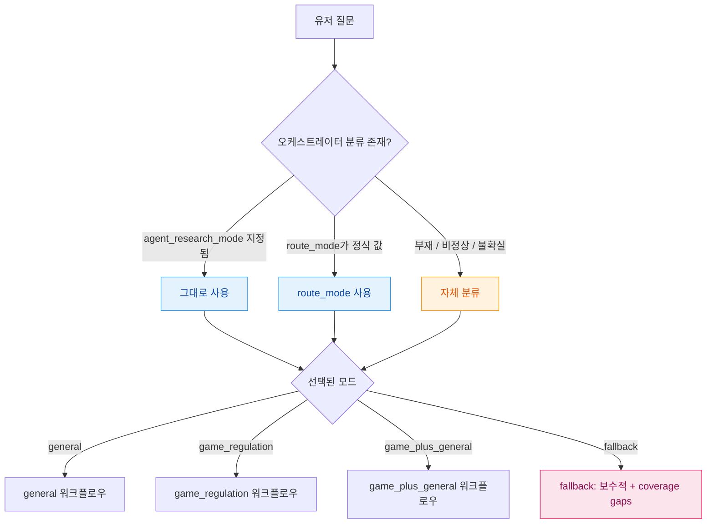
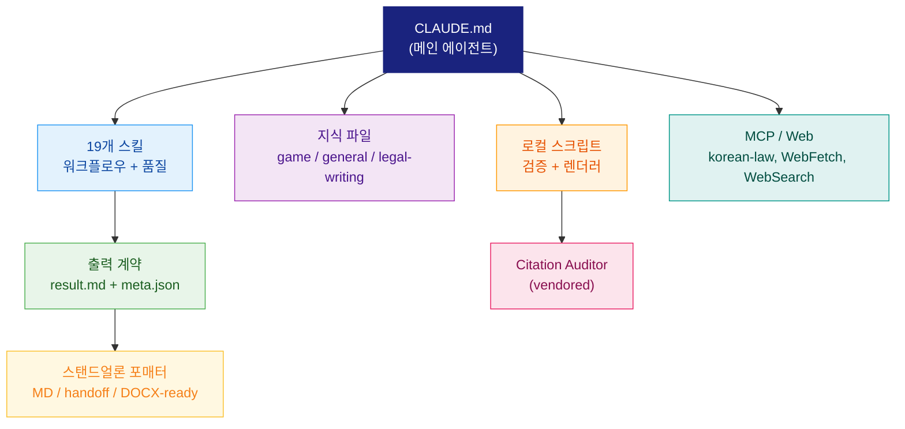
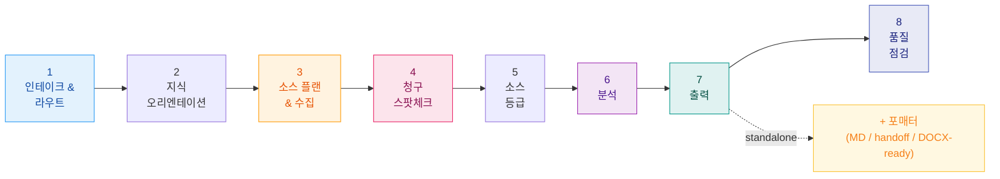

<div align="center">

# Legal Research Agent

**일반 법률 쟁점과 게임산업 규제를 위한 출처 기반 리서치 에이전트, Claude Code 위에서 동작합니다.**

[](https://claude.ai/code)
[](https://python.org)
[](#research-modes)
[](#local-preflight)

**[사용 가이드](docs/ko/how-to-use.md)** · **[면책조항](docs/ko/disclaimer.md)** · **[MCP 설정 가이드](docs/ko/mcp-setup-guide.md)** · **[Citation Audit 사양](docs/citation-audit.md)** · **[릴리즈 프로세스](docs/release-process.md)**

**[스탠드얼론 워크플로우](docs/standalone-workflow.md)** · **[오케스트레이터 인테이크](docs/orchestrator-intake.md)** · **[소스 플레이북 작성](docs/source-playbook-authoring.md)** · **[마이그레이션 노트](docs/migration-notes.md)**

**Language:** [English](README.md) · [**한국어**](README.ko.md)

</div>

> **계보:** v2 — [`general-legal-research`](https://github.com/kipeum86/general-legal-research)와 [`game-legal-research`](https://github.com/kipeum86/game-legal-research)를 단일 Claude Code 에이전트로 통합. 동일한 법률 품질 기준, 더 작은 토큰 풋프린트, 단일 디스패치 경로.

---

## 목차

- [Why This Repo Exists](#why-this-repo-exists)
- [Heritage and v2 Story](#heritage-and-v2-story)
- [Quick Start](#quick-start)
- [Research Modes](#research-modes)
- [Architecture](#architecture)
- [Workflow](#workflow)
- [Output Contract](#output-contract)
- [Source Reliability Model](#source-reliability-model)
- [Output Modes](#output-modes)
- [Citation Audit](#citation-audit)
- [Local Preflight](#local-preflight)
- [Token Discipline](#token-discipline)
- [Repository Structure](#repository-structure)
- [Roadmap](#roadmap)
- [Part of KP Legal Orchestrator](#part-of-kp-legal-orchestrator)
- [Disclaimer](#disclaimer)

---

## Why This Repo Exists

KP Legal Orchestrator는 여러 전문 에이전트를 디스패치합니다. 그중 두 개 — `general-legal-research`와 `game-legal-research` — 는 상당 부분이 겹쳤습니다. 동일한 출처 우선 원칙, 동일한 MCP / 웹 페치 표면, 동일한 오케스트레이터 호환 출력 계약. 이 둘의 디스패치 경로가 충돌하면 한 건의 매터에 대해 토큰이 두 번 소모되었고, 품질 이득 없이 중복된 리서치만 청구되었습니다.

`legal-research-agent`는 이 둘을 4가지 명시적 리서치 모드를 가진 단일 정식 에이전트로 통합합니다. 오케스트레이터는 라우트 분기당 최대 한 번만 디스패치하며, 모드별 동작은 두 개의 별도 프롬프트 표면이 아니라 컴팩트한 스킬로 보존됩니다. 결과적으로 토큰 비용은 내려가고 법률 품질은 유지됩니다.

통합의 두 번째 이유는 **유지보수**입니다. 두 전문가가 패턴 — 현행성 어휘, 청구 스팟체크, 소스 세탁 가드, 인용 계층 — 을 공유하면, 한 줄짜리 수정도 두 번 작성하고 두 번 테스트하고 두 번 감사해야 합니다. 통합하면 업그레이드 지점이 하나로 줄어듭니다. PR 하나, 회귀 점검 한 번, 롤아웃 한 번이면 끝납니다. 같은 논리로 [`GDPR-expert`](https://github.com/kipeum86/GDPR-expert)와 [`PIPA-expert`](https://github.com/kipeum86/PIPA-expert)를 단일 프라이버시 전문가로 통합하는 작업도 병행 진행 중입니다.

> [!IMPORTANT]
> **토큰 절감은 부수적 최적화입니다.** 출처 커버리지, 쟁점 도출, 현행성 점검, 인용 무결성이 보존될 때만 의미가 있습니다. 품질이 떨어지는 것이 대안이라면, 이 에이전트는 토큰을 더 씁니다 — 덜 쓰지 않습니다.

별도의 Codex 전용 형제 에이전트도 출시 예정입니다. 이번 통합이 그 전제 조건입니다 — 일반법과 게임법이 하나의 규칙 셋 안에 들어와야 `AGENTS.md` 우선의 Codex 컨벤션으로 포팅하는 작업이 메타데이터 변경 수준에서 끝납니다.

---

## Heritage and v2 Story

| 전신 | v1 역할 | v2에서의 위치 |
|:---|:---|:---|
| [`general-legal-research`](https://github.com/kipeum86/general-legal-research) | 17개 이상 관할의 일반법 전문 에이전트 | `general` 모드로 대체 |
| [`game-legal-research`](https://github.com/kipeum86/game-legal-research) | 게임산업 전문 에이전트 (확률형 아이템, 등급분류, 가상자산, 플랫폼 컴플라이언스) | `game_regulation` 모드로 대체 |

통합 계약:

| 항목 | 제약 |
|:---|:---|
| 품질 기준선 | 각 전신의 고유 영역에서 최소한 동등한 품질 |
| 출력 계약 | 레거시와 동일: `*-result.md`와 `*-meta.json` |
| 디스패치 | 매터당 단일 정식 `agent_research_mode`; 오케스트레이터가 디스패치 전 중복 제거 |
| 게임 전문성 | 전용 모드와 컴팩트 분류 체계(`knowledge/game-regulation/`)로 보존 |
| 프라이버시 / 전문가 인계 | 메타데이터에 기록; 동시 실행 중인 전문가의 분석을 중복 수행하지 않음 |
| 토큰 비교 | `scripts/compare-token-runs.py`로 레거시 베이스라인 대비 검증; `quality_reason` 없는 토큰 회귀는 롤아웃 차단 |

롤아웃 전 패리티 검증은 [`docs/general-legacy-parity-plan.md`](docs/general-legacy-parity-plan.md)에 정의되어 있습니다. 패리티 전 품질 강화 (소스 플레이북 작성, 청구 단위 검증, 현행성 체크)는 [`docs/general-quality-hardening-plan.md`](docs/general-quality-hardening-plan.md)에 정의되어 있습니다.

---

## Quick Start

### 요구사항

| 요구사항 | 설명 |
|:---|:---|
| **Claude Code** | [CLI](https://claude.ai/code) 설치 및 인증 |
| **Python 3.11+** | 검증 스크립트는 표준 라이브러리만 사용; 렌더러/테스트 경로에는 `marko`, `pydantic`, `python-docx` 필요 (`pyproject.toml` 참조) |
| **MCP 서버** | `korean-law` (`mcp__claude_ai_Korean-law__*`로 등록); 선택사항이지만 KR 1차 자료 커버리지에 강력 권장 |
| **네트워크** | `WebFetch` / `WebSearch` 폴백에 필요; 로컬 프리플라이트에는 불필요 |

### 스탠드얼론 사용

Claude Code에서 프로젝트를 열고 다음과 같이 호출합니다:

```text
/research <관할 또는 주제> <질문 본문>
```

또는 자연어로 그냥 질문해도 됩니다. 에이전트가 `CLAUDE.md`를 읽고 모드를 선택해 두 개의 계약 파일과 (요청 시) 폴리쉬된 산출물까지 생성합니다.

### 서브에이전트 디스패치

오케스트레이터 세션에서:

```text
Task(subagent_type='legal-research-agent', prompt=<intake payload JSON>)
```

에이전트 정의 파일은 [`.claude/agents/legal-research-agent.md`](.claude/agents/legal-research-agent.md)에 있고, `@`-import로 `CLAUDE.md`를 재사용하므로 스탠드얼론과 서브에이전트 표면이 어긋날 일이 없습니다.

### 첫 실행 헬스체크

```bash
python3 scripts/run-local-checks.py
```

깨끗한 리포지토리는 20/20을 통과해야 합니다. 자세한 내용은 아래 [Local Preflight](#local-preflight) 참조.

---

## Research Modes



| 모드 | 사용 시점 | 처리 방식 |
|:---|:---|:---|
| `general` | 더 좁은 전문가가 필요 없는 일반 법률 질문 | 관할과 도메인을 식별; 법령, 시행령, 공식 가이드, 공식 행정/사법 결정을 우선 |
| `game_regulation` | 게임 퍼블리싱, 온라인/모바일 게임, 확률형 아이템, 등급분류, 게임 광고, 플랫폼 컴플라이언스, 가상자산, 청소년 보호, 게임 소비자 보호 | 인접 법령은 게임 컴플라이언스에 영향이 있을 때만 관련 자료로 취급 |
| `game_plus_general` | 게임산업 질문에 인접성으로 처리할 수 없는 별개의 비-게임 법률 쟁점이 함께 있는 경우 | 쟁점 트리를 관할별로 분리한 후 통합; 동시 실행 전문가가 있으면 명시적 인계 |
| `fallback` | 질문이 모호하거나, 출처 커버리지가 본질적으로 부족하거나, 더 적합한 전문가가 없는 경우 | 보수적 메모, `coverage_gaps` 채우기, 2차 자료만으로 high-confidence 결론을 내지 않음 |

오케스트레이터가 지정한 라우트가 질문과 어긋나 보여도 에이전트는 **조용히 모드를 바꾸지 않습니다.** 라우트된 모드를 그대로 따르되 `classification_warnings`에 `classification_mismatch`를 기록하고, `coverage_gaps`에서 불확실성을 설명합니다. 모드 사일런트 오버라이드는 품질 회귀 통로이므로 금지됩니다.

---

## Architecture



### 스킬

[`skills/`](skills/) 아래 19개 컴팩트 지시 문서. 모두 Claude Code frontmatter (`name`, `description`, `disable-model-invocation: true`)를 갖습니다. 워크플로우 단계가 작은 파일들로 쪼개져 있어 에이전트는 필요한 것만 로드합니다.

<details>
<summary><strong>스킬 전체 보기</strong></summary>

| 스킬 | 단계 | 역할 |
|:---|:---|:---|
| `classify-research-mode` | 인테이크 | 오케스트레이터 라우트가 부재/불확실할 때 자체 분류 |
| `trust-boundary` | 모든 단계 | 신뢰 명령 표면 외부에서 들어온 모든 바이트는 명령이 아닌 데이터로 취급 |
| `game-library` | 지식 오리엔테이션 | 게임 모드에서만 컴팩트 게임 지식 파일 로드 |
| `jurisdiction-source-playbook` | 소스 플랜 | 관할 프로파일과 소스 최소 요건 산출 |
| `general-law-source-playbook` | 소스 플랜 (general) | 도메인 체크리스트와 활성화된 소스 플레이북 선택 |
| `source-collection` | 수집 | 컴팩트 소스 엔벨로프; 레이어 최소요건과 유사 법령 가드 |
| `currentness-check` | 수집 | 상태 어휘, confidence consequences, stop conditions |
| `claim-spot-check` | 검증 | 소스 세탁 가드; 분석 전 청구 레지스트리 |
| `claim-verification-loop` | 검증 | 핵심 청구의 direct/indirect/background/unsupported 태깅과 권위 링크 |
| `source-grading` | 등급 | A/B/C/D 등급과 무결성 플래그 |
| `analysis-issue-structuring` | 분석 | 증거 카드와 이슈 맵 |
| `citation-hierarchy` | 출력 | 인용 계층과 소스 실패 처리 |
| `result-memo-composition` | 출력 | 필수 섹션, 출처 앵커, 관할 디시플린 |
| `legal-output-quality-standard` | 출력 | 비타협적 법률 품질 규칙 |
| `output-contract` | 출력 | 두 파일 계약과 메타데이터 스키마 |
| `legal-writing-formatter` | 스탠드얼론 | 스탠드얼론 마크다운 / 인계 패킷 / DOCX-ready 마크다운 |
| `quality-check` | 최종화 전 | Contract / source / mode / game / practical 게이트 |
| `general-research` | 모드 | general 모드 워크플로우와 디시플린 |
| `game-regulation-research` | 모드 | game 모드 워크플로우와 분류 체계 |

</details>

### 지식

[`knowledge/`](knowledge/) 아래 모드별로 분리된 컴팩트 지식:

```text
knowledge/
├── game-regulation/        # 분류 체계, 규제기관 맵, 소스 맵, 라이브러리 인덱스
├── general/                # 도메인 체크리스트, 소스 맵, 소스 플레이북 인덱스
│   └── playbooks/          # 활성화된 도메인별 소스 플레이북 (예: kr-platform-service)
└── legal-writing/          # ko / en 포매터 프로파일 + DOCX-ready 프로파일
```

에이전트는 활성 모드와 언어에 일치하는 프로파일만 로드합니다. 이중 언어 로드는 명시적으로 요청된 경우에만 발생합니다.

### Citation auditor (vendored)

[`citation-auditor`](citation_auditor/)가 vendored 형태로 포함되어 있습니다 — 패키지, [`.claude/skills/citation-auditor/`](.claude/skills/citation-auditor/) 의 Claude Code 스킬, [`.claude/skills/verifiers/`](.claude/skills/verifiers/) 의 verifier 플러그인, 그리고 [`/audit`](/.claude/commands/audit.md) 슬래시 커맨드. 의도적으로 업그레이드할 때만 vendor stamp를 갱신합니다:

```bash
../citation-auditor/scripts/vendor-into.sh "$PWD"
```

vendor 스모크는 `python3 scripts/check-citation-auditor-vendor.py`로, 결정론적 chunk/aggregate/render 스모크는 `python3 scripts/check-citation-auditor-smoke.py`로 실행합니다. 라이브 verifier 디스패치는 Claude Code 세션 능력이지 프리플라이트 게이트가 아닙니다.

---

## Workflow

에이전트는 컴팩트하지만 디시플린된 8단계 워크플로우를 따릅니다:



| 단계 | 산출물 |
|:---:|:---|
| **1** | 파싱된 인테이크 (`user_question`, `active_profile`, `orchestrator_classification`, `co_running_agents`, `output_dir`)와 선택된 리서치 모드 |
| **2** | 활성 모드에 맞는 지식 파일만 로드 |
| **3** | 관할 프로파일, 소스 최소 요건, 컴팩트 소스 엔벨로프, 현행성 태그 |
| **4** | 청구 레지스트리; 핵심 청구는 `claim_checks` 항목과 support strength |
| **5** | 등급화된 소스 (A/B/C/D)와 무결성 플래그 |
| **6** | 권위 링크가 달린 이슈 맵; 핵심 결론에는 반론 분석 포함 |
| **7** | `legal-research-agent-result.md` + `legal-research-agent-meta.json`; 선택적 스탠드얼론 산출물 |
| **8** | Contract / source / mode / game / practical 게이트; 로컬 실행 가능 시 `python3 scripts/validate-output.py` |

전체 워크플로우는 [`CLAUDE.md`](CLAUDE.md)에 인코딩되어 있습니다. 단계별 스킬 경로는 명시적인 "apply" 지시와 함께 거기에 나열되어 있어 에이전트가 단계를 조용히 건너뛸 수 없게 되어 있습니다.

---

## Output Contract

에이전트는 정확히 두 파일을 `{OUTPUT_DIR}`에 작성해야 합니다:

```text
legal-research-agent-result.md
legal-research-agent-meta.json
```

기존 오케스트레이터 리더는 다음 추가 친화적 표면만 의존하면 됩니다:

- `summary`
- `issue_map`
- `key_findings`
- `sources`
- `error`

아래의 더 풍부한 필드는 추가형(additive)입니다 — 구버전 리더는 무시하고, 로컬 검증기는 이를 사용해 패리티 테스트 전에 stale authority, unsupported claims, missing source layers, route-vs-question 불일치를 잡아냅니다.

<details>
<summary><strong>필수 메타데이터 필드</strong></summary>

```text
meta_version
summary
research_mode                    # general | game_regulation | game_plus_general | fallback
mode_source                      # orchestrator | self_classified
active_profile                   # "merged"
orchestrator_route_mode
fallback_reason
classification_warnings
co_running_agents
jurisdictions
domains
issue_map
key_findings
sources
comparison_matrix
coverage_gaps
error                            # null | mcp_unavailable | partial_sources | timeout |
                                 # classification_ambiguous | classification_mismatch |
                                 # source_coverage_insufficient | internal_error
```

</details>

<details>
<summary><strong>선택적 currentness · claim-check 필드</strong></summary>

```json
{
  "sources": [{
    "id": "src_001",
    "currentness": {
      "status": "checked_current",
      "checked_as_of": "2026-05-06",
      "effective_date": null,
      "notes": "공식 현행본 확인 완료."
    }
  }],
  "claim_checks": [{
    "claim_id": "claim_001",
    "issue_id": "issue_001",
    "claim": "핵심 법률 명제.",
    "authority_ids": ["src_001"],
    "support_strength": "direct",
    "currentness": "checked",
    "confidence_impact": "supports_medium_or_high",
    "limitation": "확인된 한계 없음."
  }]
}
```

어휘는 [`skills/currentness-check.md`](skills/currentness-check.md)와 [`skills/claim-verification-loop.md`](skills/claim-verification-loop.md)에 정의되어 있습니다. 고신뢰 쟁점은 직접 청구 검증을 요구하며, 통제 권위 소스가 `not_checked` / `pending_change` / `stale_or_superseded` 상태이면 high confidence가 차단됩니다.

</details>

로컬 계약은 [`docs/orchestrator-intake.md`](docs/orchestrator-intake.md)에 문서화되어 있습니다. 샘플 페이로드 검증:

```bash
python3 scripts/validate-intake-payload.py tests/fixtures/intake-payloads
```

임의의 출력 디렉터리 검증:

```bash
python3 scripts/validate-output.py /path/to/output
python3 scripts/check-result-structure.py /path/to/output
python3 scripts/evaluate-quality.py /path/to/output \
  --case-spec tests/fixtures/quality/kr_loot_box-quality-spec.json
```

---

## Source Reliability Model

| 등급 | 설명 |
|:---:|:---|
| **A** | 법률, 시행령, 공식 규제기관 가이드, 공식 법원 결정, 공식 행정청 결정 |
| **B** | 공식 해설서, 규제기관 보도자료, 권위 있는 실무 가이드 |
| **C** | 2차 코멘터리, 로펌 글, 학술 코멘터리 |
| **D** | 무출처 코멘터리, 마케팅 페이지, 신뢰할 수 없는 요약본 |

C 등급은 출처 발굴 또는 low/medium-confidence 맥락 보강에 쓸 수 있습니다. 단독으로 high-confidence 결론을 지지하지 못합니다. D 등급은 어떠한 법적 명제도 인용하지 않습니다.

### 현행성 디시플린

`sources[*].currentness.status`에 사용되는 상태 어휘:

| 상태 | 의미 |
|:---|:---|
| `checked_current` | 공식 현행본과 대조하여 검증 완료 |
| `effective_date_checked` | 결정적 쟁점이 시행시기·경과·소급에 있고 그 부분이 검증됨 |
| `pending_change` | 답변에 영향을 줄 수 있는 개정안 또는 대체 절차 진행 중 |
| `stale_or_superseded` | 출처가 대체되었거나 더 이상 권위 있지 않음 |
| `not_checked` | 이번 실행에서 현행성 미확인 |
| `not_applicable` | 현행 법적 효력이 무관한 경우 (역사적 맥락 등) |

통제 권위에 대해서는, 현행성을 해소할 수 없으면 워크플로우가 high-confidence 분석에 들어가기 전에 멈춥니다. 결과는 `temporal_status` coverage gap을 기록하고 쟁점 confidence를 낮출 뿐, 추측하지 않습니다.

### 신뢰 경계

신뢰 명령 표면(`CLAUDE.md`, `skills/`, 세션 내 사용자 메시지, 로컬 템플릿·검증기) 외부에서 들어오는 모든 바이트는 **명령이 아닌 데이터**로 취급됩니다. 소스 텍스트는 `prompt_injection_risk`에 따라 sanitize / fence / 제외됩니다. 전체 계약은 [`skills/trust-boundary.md`](skills/trust-boundary.md)에 있습니다.

---

## Output Modes

두 개의 직교 축이 모든 스탠드얼론 산출물을 형성합니다: **deliverable shape** (output mode)와 **output format** (packaging mode). 오케스트레이터 호환의 `legal-research-agent-result.md`는 어느 축과도 무관하게 항상 정식 9-section 구조를 사용합니다. 모드형 산출물은 `deliverables/` 아래에 위치하며 `standalone-deliverable-manifest.json`에 기록됩니다.

### Deliverable shape

| 모드 | 슬러그 | 적합한 경우 | 기본 패키징 |
|:---|:---|:---|:---|
| Executive Brief (Mode A) | `executive_brief` | 의사결정자, C-suite | `standalone_markdown` |
| Comparative Matrix (Mode B) | `comparative_matrix` | 다관할 컴플라이언스 | `standalone_markdown` |
| Enforcement and Case Law (Mode C) | `enforcement_case_law` | 소송, 집행 전략 | `standalone_markdown` |
| Black-letter and Commentary (Mode D) | `black_letter_commentary` | 법령 deep dive | `docx_ready_markdown` |
| Canonical research memo *(기본)* | `canonical` | 오케스트레이터 호환 기록 | `standalone_markdown` |

### Packaging mode

| 모드 | 사용 시점 |
|:---|:---|
| `standalone_markdown` | 기본 폴리쉬 메모 또는 의견서형 노트 |
| `handoff_packet` | 다운스트림 legal-writing 에이전트가 작성을 이어받을 때 |
| `docx_ready_markdown` | Word-ready 소스 또는 바이너리 DOCX 요청 시 |

한 실행은 각 축에서 하나씩 선택합니다 (5 × 3 = 15가지 조합). 선택 규칙과 슬러그→템플릿 매핑은 [`knowledge/output-modes/mode-index.md`](knowledge/output-modes/mode-index.md)에 있습니다.

### 프레임워크와 디시플린

비-canonical 모드는 두 공통 프레임워크 참조를 공유합니다:

- [`knowledge/output-modes/comparative-framework.md`](knowledge/output-modes/comparative-framework.md) — 10개 표준 비교 axes (`comparative_matrix` 필수)
- [`knowledge/output-modes/counter-analysis-checklist.md`](knowledge/output-modes/counter-analysis-checklist.md) — 6개 counter-analysis 차원 + 모드별 최소요건

각 모드는 [`templates/output-modes/`](templates/output-modes/)에 구조 템플릿을 두며, [`scripts/check-output-modes.py`](scripts/check-output-modes.py) validator가 강제합니다.

### 스탠드얼론 워크플로우

전체 산출물 레이아웃, 네이밍 규칙, 매니페스트, citation-audit 시퀀싱은 [`docs/standalone-workflow.md`](docs/standalone-workflow.md)에 있습니다. DOCX 렌더:

```bash
python3 scripts/render-docx.py /path/to/deliverable.md \
  /path/to/deliverable.docx \
  --language ko \
  --jurisdiction korea \
  --report /path/to/deliverable.docx.render.json
```

DOCX 렌더링은 MVP 수준입니다 — 헤딩, 단순 표, 리스트, 블록 인용, 가시 텍스트. 네이티브 각주, 변경 추적, 코멘트, 복잡한 페이지 레이아웃은 의도적으로 약속하지 않습니다.

폴리쉬 산출물 검증:

```bash
python3 scripts/check-formatter-output.py /path/to/formatted.md \
  --meta /path/to/legal-research-agent-meta.json \
  --language ko
```

스탠드얼론 매니페스트 전체 검증:

```bash
python3 scripts/check-standalone-workflow.py /path/to/output
```

---

## Citation Audit

Citation audit은 두 컨텍스트에서 동작하며, [`.claude/skills/verifiers/`](.claude/skills/verifiers/) 아래의 동일 verifier 패밀리(한국법, 미국, 영국, EU, scholarly, 위키, general web)를 공유합니다.

| 컨텍스트 | 트리거 | 동작 |
|:---|:---|:---|
| **스탠드얼론 `/audit`** | 임의의 마크다운/DOCX 파일에 대해 수동 호출 | 마크다운엔 인라인 어노테이션; DOCX엔 `*.audit.md`/`*.audit.json` 사이드카 |
| **스탠드얼론 산출물 워크플로우** | 외부/클라이언트 대상 스탠드얼론 산출물 | 산출물 매니페스트에 audit이 폴드됨; `live_passed` vs `deterministic_smoke` vs `not_run_session_unavailable`이 명시적으로 기록 |

전망, 의견, 소문, 추측성 표현은 의도적으로 건너뜁니다 — 검증 가능한 사실/인용 청구만 audit 대상입니다.

의도적 업그레이드 시에만 vendor 갱신:

```bash
../citation-auditor/scripts/vendor-into.sh "$PWD"
```

---

## Local Preflight

전체 로컬 프리플라이트는 단일 명령으로 실행:

```bash
python3 scripts/run-local-checks.py
python3 scripts/run-local-checks.py --report
```

깨끗한 리포지토리는 1초 미만에 20/20을 통과합니다. 실패는 check id별로 분리되어 어느 표면이 깨졌는지 정확히 가리킵니다.

<details>
<summary><strong>개별 체크 명령</strong></summary>

```bash
# Output contract와 result structure
python3 scripts/validate-output.py tests/fixtures/output/valid
python3 scripts/check-result-structure.py tests/fixtures/output/valid
python3 scripts/evaluate-quality.py tests/fixtures/output/valid \
  --case-spec tests/fixtures/quality/kr_loot_box-quality-spec.json

# Fixtures, smoke, intake
python3 scripts/smoke-check.py
python3 scripts/check-fixture-consistency.py
python3 scripts/validate-intake-payload.py tests/fixtures/intake-payloads

# Knowledge, source playbooks, formatter, standalone, DOCX
python3 scripts/check-knowledge-coverage.py
python3 scripts/check-source-playbooks.py
python3 scripts/check-formatter-output.py tests/fixtures/formatter
python3 scripts/check-standalone-workflow.py tests/fixtures/standalone-workflow
python3 scripts/check-docx-generation.py

# Claude Code 컨벤션 (skill frontmatter, agent, settings, command, prereq, AGENTS.md)
python3 scripts/check-claude-conventions.py

# Citation auditor vendor + smoke
python3 scripts/check-citation-auditor-vendor.py
python3 scripts/check-citation-auditor-smoke.py

# 토큰 비교 및 풋프린트 진단
python3 scripts/measure-prompt-footprint.py
python3 scripts/measure-tokens.py path/to/events.jsonl
python3 scripts/compare-token-runs.py tests/fixtures/token-comparison/token-comparison-manifest.json

# Golden set 및 lint
python3 scripts/evaluate-golden-set.py
bash tests/lint_no_legacy_invocation.sh
```

소스 플레이북 작성 스캐폴드:

```bash
python3 scripts/create-source-playbook.py \
  --jurisdiction KR \
  --domain platform_service \
  --title "KR Platform Service"
python3 scripts/check-source-playbooks.py
```

작성 워크플로우는 [`docs/source-playbook-authoring.md`](docs/source-playbook-authoring.md)에 문서화되어 있습니다.

</details>

---

## Token Discipline

토큰 비용은 목표지 법률 품질을 누르는 제약이 아닙니다.

### 풋프린트 진단

```bash
python3 scripts/measure-prompt-footprint.py
python3 scripts/measure-prompt-footprint.py --include-vendor
```

이는 리포지토리 인스트럭션의 안정적인 rough-token 프록시일 뿐, 실제 Claude Code `events.jsonl`에서 측정한 end-to-end 사용량을 대체하지 않습니다. Phase 0 베이스라인은 [`docs/prompt-footprint.md`](docs/prompt-footprint.md)에 기록되어 있고, 레거시 패리티 비교를 위해 의도적으로 동결되어 있습니다.

### 실행 비교

```bash
python3 scripts/compare-token-runs.py \
  tests/fixtures/token-comparison/token-comparison-manifest.json
```

하니스는 실제 `events.jsonl` 토큰 합계를 우선합니다. 프록시 메트릭은 검토 데이터로만 명확히 표시된 채 허용됩니다. 통합 에이전트 실행이 레거시 베이스라인보다 토큰을 더 쓰면, 매니페스트에 `quality_reason`이 기록되지 않은 한 로컬 비교 게이트가 실패합니다. 선택적 `quality_report` 파일을 첨부하면 매니페스트의 `quality_status`가 실제 품질 게이트 결과와 대조 검증됩니다. 통합 실행에서 호출 카운트가 증가한 경우에도 `agent_call_reason` 설명이 없으면 차단됩니다.

### 품질 우위

다음 상황에서는 결과를 차단하거나 미완으로 표시합니다:

- 핵심 쟁점이 리서치되지 않음;
- 통제 관할이 누락됨;
- 핵심 결론이 1차 또는 공식 자료의 지지를 받아야 하는데 그렇지 못함;
- 2차 코멘터리가 1차 법령처럼 세탁됨;
- 통제 규범의 현행성 또는 시행일이 미해결;
- 프라이버시·IP·세무·금융 등 전문가 쟁점이 핵심인데 표면적으로만 다뤄짐.

품질 보존을 위해 토큰이 예상보다 더 필요하다면, 그 토큰을 쓰고 그 사유를 `coverage_gaps` 또는 결과 메모의 적절한 위치에 기록합니다.

---

## Repository Structure

<details>
<summary><strong>디렉터리 트리 보기</strong></summary>

```text
legal-research-agent/
├── CLAUDE.md                          # 메인 에이전트 지시문 (여기서 시작)
├── AGENTS.md                          # 크로스툴 shim (@CLAUDE.md import)
├── README.md                          # English README
├── README.ko.md                       # 이 파일
├── pyproject.toml                     # Python 3.11+, marko / pydantic / python-docx
│
├── .claude/
│   ├── agents/
│   │   └── legal-research-agent.md    # 서브에이전트 정의 (오케스트레이터 디스패치)
│   ├── commands/
│   │   ├── research.md                # /research 슬래시 커맨드
│   │   └── audit.md                   # /audit 슬래시 커맨드 (citation-auditor)
│   ├── settings.json                  # 권한 allowlist (Bash + WebFetch + MCP)
│   └── skills/                        # vendored citation-auditor + verifiers
│       ├── citation-auditor/
│       └── verifiers/                 # kr / us / uk / eu / scholarly / wikipedia / general-web
│
├── skills/                            # 19개 메인 에이전트 워크플로우/품질 스킬
├── knowledge/
│   ├── game-regulation/               # 분류 체계, 규제기관 맵, 소스 맵, 라이브러리 인덱스
│   ├── general/                       # 도메인 체크리스트, 소스 맵, 플레이북 인덱스 + 활성 플레이북
│   └── legal-writing/                 # ko / en 포매터 프로파일 + DOCX-ready 프로파일
│
├── citation_auditor/                  # /audit을 뒷받침하는 vendored Python 패키지
├── templates/                         # result.md / meta.example.json / source-playbook.example.md
│
├── scripts/
│   ├── run-local-checks.py            # 전체 프리플라이트 (20개 체크)
│   ├── validate-output.py             # 오케스트레이터 호환 스키마
│   ├── check-result-structure.py      # 결과 메모 구조 게이트
│   ├── evaluate-quality.py            # 스키마 너머의 법률 품질 게이트
│   ├── check-formatter-output.py      # 스탠드얼론 포매터 검증
│   ├── check-standalone-workflow.py   # 스탠드얼론 매니페스트 검증
│   ├── check-claude-conventions.py    # Claude Code 표면 검증
│   ├── check-knowledge-coverage.py    # 필수 마커 보존 확인
│   ├── check-source-playbooks.py      # 일반법 플레이북 레지스트리 검증
│   ├── check-fixture-consistency.py   # case / spec / golden-set fixture 일관성
│   ├── check-citation-auditor-*.py    # vendor + 결정론적 audit 스모크
│   ├── check-docx-generation.py       # DOCX render + extraction 스모크
│   ├── render-docx.py                 # MVP DOCX 렌더러
│   ├── create-source-playbook.py      # 작성 스캐폴드
│   ├── evaluate-golden-set.py         # golden-set 배치 품질 평가
│   ├── validate-intake-payload.py     # 오케스트레이터 → 에이전트 인테이크 스키마
│   ├── measure-prompt-footprint.py    # rough-token 프록시 진단
│   ├── measure-tokens.py              # events.jsonl 집계기
│   ├── compare-token-runs.py          # 레거시 vs 통합 토큰/품질/호출 카운트 비교
│   └── smoke-check.py                 # 스모크 fixture 검증
│
├── tests/                             # pytest 스타일 unittest (165 tests)
│   ├── fixtures/
│   └── test_*.py
│
└── docs/
    ├── standalone-workflow.md         # 스탠드얼론 산출물 명세
    ├── orchestrator-intake.md         # 인테이크 페이로드 계약
    ├── source-playbook-authoring.md   # 컨트리뷰터 스캐폴드
    ├── general-quality-hardening-plan.md
    ├── general-legacy-parity-plan.md
    ├── claude-code-scaffolding-plan.md
    ├── golden-set.md
    ├── prompt-footprint.md            # 동결된 Phase 0 베이스라인
    └── migration-notes.md
```

</details>

---

## Roadmap

- [x] `general-legal-research`와 `game-legal-research`를 단일 디스패치 경로로 통합
- [x] Claude Code 스킬 frontmatter, 서브에이전트 정의, 설정, 슬래시 커맨드 추가
- [x] 일반법 소스 플레이북 작성 스캐폴드와 현행성 어휘 적용
- [x] `citation-auditor` 및 verifier 플러그인 패밀리 vendor 처리
- [ ] `general-legal-research` 정식 패리티 비교 실행 ([`docs/general-legacy-parity-plan.md`](docs/general-legacy-parity-plan.md) 참조)
- [ ] `game-legal-research` 정식 패리티 비교 실행
- [ ] 동일 통합 패턴을 [`GDPR-expert`](https://github.com/kipeum86/GDPR-expert) + [`PIPA-expert`](https://github.com/kipeum86/PIPA-expert)에 적용 — 통합 프라이버시 전문가 (진행 중)
- [ ] Codex 전용 형제 에이전트 출시 (동일 스킬, `AGENTS.md` 우선, Codex CLI 컨벤션)
- [ ] 중복 제거된 단일 에이전트 라우트로 `legal-agent-orchestrator` 디스패치 그래프 경량화
- [ ] citation-audit 스탠드얼론 워크플로우용 라이브 verifier 통합 테스트 fixture 추가

---

## Part of KP Legal Orchestrator

이 에이전트는 **KP Legal Orchestrator** 전문 법률 워크플로우 에이전트 시리즈의 일부입니다:

| 에이전트 | 역할 | 전문 영역 |
|:---|:---|:---|
| **`legal-research-agent`** *(이 리포)* | **법률 리서치 전문가 (v2)** | **일반법 + 게임산업 규제** |
| ~~[`general-legal-research`](https://github.com/kipeum86/general-legal-research)~~ | ~~일반법 전문~~ | 이 리포의 `general` 모드로 대체 |
| ~~[`game-legal-research`](https://github.com/kipeum86/game-legal-research)~~ | ~~게임산업 전문~~ | 이 리포의 `game_regulation` 모드로 대체 |
| [`legal-translation-agent`](https://github.com/kipeum86/legal-translation-agent) | 법률 번역 전문 | 법률 번역 |
| [`PIPA-expert`](https://github.com/kipeum86/PIPA-expert) | 프라이버시 전문 (한국) | 한국 개인정보보호법 |
| [`GDPR-expert`](https://github.com/kipeum86/GDPR-expert) | 프라이버시 전문 (EU) | GDPR |
| [`contract-review-agent`](https://github.com/kipeum86/contract-review-agent) | 계약 전문 | 계약서 검토 |
| [`legal-writing-agent`](https://github.com/kipeum86/legal-writing-agent) | 법률 작성 전문 | 법률 작성 |
| [`second-review-agent`](https://github.com/kipeum86/second-review-agent) | 시니어 리뷰 전문 | 품질 검토 |

---

<div align="center">

## Disclaimer

이 프로젝트는 법률 리서치 워크플로우를 보조합니다. 법률 자문을 제공하지 않습니다.
법적 결정이 필요한 경우, 해당 관할의 자격을 갖춘 전문가의 자문을 받으시기 바랍니다.

</div>
