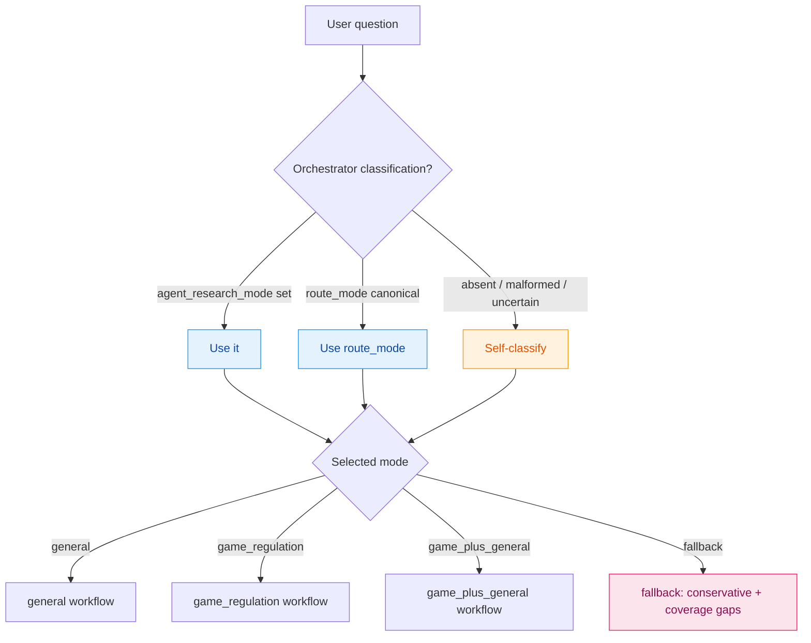
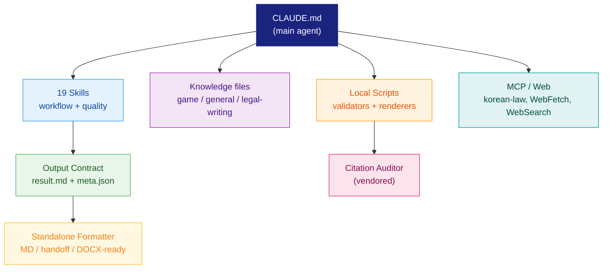
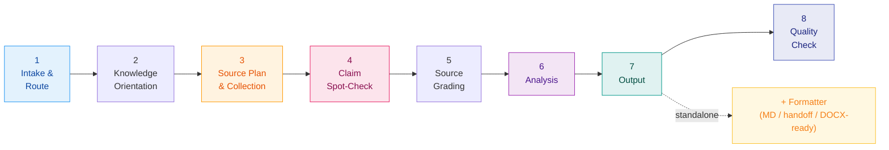

<div align="center">

# Legal Research Agent

**Source-first legal research for general legal questions and game-industry regulation, on Claude Code.**

[](https://claude.ai/code)
[](https://python.org)
[](#research-modes)
[](#local-preflight)

**[Standalone Workflow](docs/standalone-workflow.md)** · **[Orchestrator Intake](docs/orchestrator-intake.md)** · **[Source Playbook Authoring](docs/source-playbook-authoring.md)** · **[Migration Notes](docs/migration-notes.md)**

**Language:** [**English**](README.md) · [한국어](README.ko.md)

</div>

> **Heritage:** v2 — merges [`general-legal-research`](https://github.com/kipeum86/general-legal-research) and [`game-legal-research`](https://github.com/kipeum86/game-legal-research) into one Claude Code agent. Same legal-quality floor, smaller token footprint, single dispatch path.

---

## Table of Contents

- [Why This Repo Exists](#why-this-repo-exists)
- [Heritage and v2 Story](#heritage-and-v2-story)
- [Quick Start](#quick-start)
- [Research Modes](#research-modes)
- [Architecture](#architecture)
- [Workflow](#workflow)
- [Output Contract](#output-contract)
- [Source Reliability Model](#source-reliability-model)
- [Standalone Deliverables](#standalone-deliverables)
- [Citation Audit](#citation-audit)
- [Local Preflight](#local-preflight)
- [Token Discipline](#token-discipline)
- [Repository Structure](#repository-structure)
- [Roadmap](#roadmap)
- [Part of KP Legal Orchestrator](#part-of-kp-legal-orchestrator)
- [Disclaimer](#disclaimer)

---

## Why This Repo Exists

The KP Legal Orchestrator dispatches a portfolio of specialist agents. Two of them — `general-legal-research` and `game-legal-research` — overlapped substantially: the same source-first discipline, the same MCP and web-fetch surface, the same orchestrator-compatible output contract. Their dispatch paths could collide, billing the orchestrator twice for one matter while producing duplicate research with no quality benefit.

`legal-research-agent` collapses that pair into one canonical agent with four explicit research modes. The orchestrator dispatches at most once per route branch. Mode-specific behavior survives as compact skills rather than two separate prompt surfaces. Token cost goes down. Legal quality does not.

> [!IMPORTANT]
> Token savings are a secondary optimization. They count only when source coverage, issue spotting, currentness discipline, and citation integrity are preserved. The agent will spend more tokens — not fewer — when the alternative is a quality regression.

A Codex-tuned sibling agent is planned. The merge here is the prerequisite: once general-law and game-law live in one rule set, porting to `AGENTS.md`-first Codex conventions is a metadata change, not a re-implementation.

---

## Heritage and v2 Story

| Predecessor | v1 role | Status in v2 |
|:---|:---|:---|
| [`general-legal-research`](https://github.com/kipeum86/general-legal-research) | General-law specialist across 17+ jurisdictions | Replaced by `general` mode |
| [`game-legal-research`](https://github.com/kipeum86/game-legal-research) | Game-industry specialist (loot boxes, ratings, virtual goods, platform compliance) | Replaced by `game_regulation` mode |

The merge contract:

| Property | Constraint |
|:---|:---|
| Quality floor | At least matches each predecessor on its native domain |
| Output contract | Identical to legacy: `*-result.md` and `*-meta.json` |
| Dispatch | One canonical `agent_research_mode` per matter; orchestrator deduplicates |
| Game expertise | Preserved as a dedicated mode plus compact taxonomy in `knowledge/game-regulation/` |
| Privacy / specialist handoff | Recorded in metadata; this agent does not duplicate co-running specialist analysis |
| Token comparison | Gated by `scripts/compare-token-runs.py` against legacy baselines; merged-run token regressions block rollout unless explained by a quality reason |

Pre-rollout parity is documented in [`docs/general-legacy-parity-plan.md`](docs/general-legacy-parity-plan.md). Pre-parity quality hardening — source playbook authoring, claim-level verification, currentness checks — is documented in [`docs/general-quality-hardening-plan.md`](docs/general-quality-hardening-plan.md).

---

## Quick Start

### Requirements

| Requirement | Details |
|:---|:---|
| **Claude Code** | [CLI](https://claude.ai/code) installed and authenticated |
| **Python 3.11+** | Standard library only for the validators; `marko`, `pydantic`, and `python-docx` for renderer/test paths (see `pyproject.toml`) |
| **MCP server** | `korean-law` (registered as `mcp__claude_ai_Korean-law__*`); optional but strongly preferred for KR primary-source coverage |
| **Network** | Required for `WebFetch` / `WebSearch` fallbacks; not required for the local preflight |

### Standalone use

Open the project in Claude Code and either:

```text
/research <jurisdiction or topic> <question text>
```

or just describe your question in plain language. The agent reads `CLAUDE.md`, picks a mode, and produces the two contract files plus an optional polished deliverable.

### Subagent dispatch

From an orchestrator session:

```text
Task(subagent_type='legal-research-agent', prompt=<intake payload JSON>)
```

The agent definition lives at [`.claude/agents/legal-research-agent.md`](.claude/agents/legal-research-agent.md) and re-uses `CLAUDE.md` via `@`-import so the standalone and subagent surfaces never drift.

### First-run sanity check

```bash
python3 scripts/run-local-checks.py
```

A clean repo passes 20/20. See [Local Preflight](#local-preflight) below.

---

## Research Modes



| Mode | When to use | Treatment |
|:---|:---|:---|
| `general` | Ordinary legal questions where no narrower specialist is required | Identify jurisdictions and domains; prefer statutes, regulations, official guidance, official agency or court decisions |
| `game_regulation` | Game publishing, online/mobile games, randomized items, ratings, game advertising, platform compliance, virtual goods, youth protection, game consumer protection | Adjacent law treated as relevant only where it affects game compliance |
| `game_plus_general` | Game-industry question with a distinct non-game legal issue that cannot be handled as adjacency | Build separate issue trees, then synthesize with explicit handoff if a specialist is co-running |
| `fallback` | Question is ambiguous, source coverage is materially insufficient, or the topic is outside the agent's competence with no better specialist available | Conservative memo, populated `coverage_gaps`, and no high-confidence conclusions on secondary sources alone |

If the orchestrator-supplied route looks inconsistent with the question, the agent does **not** silently switch modes. It continues with the routed mode, records `classification_mismatch` in `classification_warnings`, and explains the uncertainty in `coverage_gaps`. Mode silence-and-override is a quality regression vector and is forbidden.

---

## Architecture



### Skills

19 compact instruction documents under [`skills/`](skills/), each with Claude Code frontmatter (`name`, `description`, `disable-model-invocation: true`). Workflow stages are split across small files so the agent loads only what it needs.

<details>
<summary><strong>View all skills</strong></summary>

| Skill | Stage | Role |
|:---|:---|:---|
| `classify-research-mode` | Intake | Self-classifies when orchestrator route is missing or uncertain |
| `trust-boundary` | All stages | Treats every byte from outside the trusted instruction surface as data, not instruction |
| `game-library` | Knowledge orientation | Loads compact game-knowledge files for game modes only |
| `jurisdiction-source-playbook` | Source plan | Produces a jurisdiction profile and source minimums |
| `general-law-source-playbook` | Source plan (general) | Picks a domain checklist and any active source playbook |
| `source-collection` | Collection | Compact source envelopes; layer-minimum and similar-statute guards |
| `currentness-check` | Collection | Status vocabulary, confidence consequences, stop conditions |
| `claim-spot-check` | Verification | Source laundering guard; pre-analysis registry |
| `claim-verification-loop` | Verification | Material-claim direct/indirect/background/unsupported tags with authority links |
| `source-grading` | Grading | Grades A/B/C/D plus integrity flags |
| `analysis-issue-structuring` | Analysis | Evidence cards and the issue map |
| `citation-hierarchy` | Output | Citation hierarchy and source-failure handling |
| `result-memo-composition` | Output | Required sections, source anchors, jurisdiction discipline |
| `legal-output-quality-standard` | Output | Non-negotiable legal-quality rules |
| `output-contract` | Output | Two-file contract and metadata schema |
| `legal-writing-formatter` | Standalone | Standalone Markdown / handoff packet / DOCX-ready Markdown |
| `quality-check` | Pre-finalize | Contract / source / mode / game / practical gates |
| `general-research` | Mode | General-mode workflow and discipline |
| `game-regulation-research` | Mode | Game-mode workflow and taxonomy |

</details>

### Knowledge

Compact, mode-scoped knowledge under [`knowledge/`](knowledge/):

```text
knowledge/
├── game-regulation/        # taxonomy, regulator map, source map, library index
├── general/                # domain checklist, source map, source-playbook index
│   └── playbooks/          # active per-domain source playbooks (e.g., kr-platform-service)
└── legal-writing/          # ko / en formatter profiles + DOCX-ready profile
```

The agent loads only the matching profile for the active mode and language. Bilingual loading happens only when explicitly requested.

### Citation auditor (vendored)

[`citation-auditor`](citation_auditor/) ships vendored — the package, the Claude Code skill at [`.claude/skills/citation-auditor/`](.claude/skills/citation-auditor/), the verifier plugins under [`.claude/skills/verifiers/`](.claude/skills/verifiers/), and the [`/audit`](/.claude/commands/audit.md) slash command. Refresh the vendor stamp from the sibling source repo only when intentionally upgrading:

```bash
../citation-auditor/scripts/vendor-into.sh "$PWD"
```

The vendor smoke runs in `python3 scripts/check-citation-auditor-vendor.py` and the deterministic chunk/aggregate/render smoke runs in `python3 scripts/check-citation-auditor-smoke.py`. Live verifier dispatch is a Claude Code session capability, not a preflight gate.

---

## Workflow

The agent follows a compact but disciplined eight-stage workflow:



| Stage | Output |
|:---:|:---|
| **1** | Parsed intake (`user_question`, `active_profile`, `orchestrator_classification`, `co_running_agents`, `output_dir`) and selected research mode |
| **2** | Loaded knowledge files for the active mode only |
| **3** | Jurisdiction profile, source minimums, compact source envelopes, currentness tags |
| **4** | Claim registry; for material claims, `claim_checks` entries with support strength |
| **5** | Graded sources (A/B/C/D) plus integrity flags |
| **6** | Issue map with authority links; counter-analysis for material conclusions |
| **7** | `legal-research-agent-result.md` + `legal-research-agent-meta.json`; optional standalone deliverable |
| **8** | Contract / source / mode / game / practical gates; `python3 scripts/validate-output.py` when local execution is available |

The full workflow is encoded in [`CLAUDE.md`](CLAUDE.md). Stage skill paths are listed there with explicit "apply" instructions so the agent never silently skips a stage.

---

## Output Contract

The agent must write exactly two files into `{OUTPUT_DIR}`:

```text
legal-research-agent-result.md
legal-research-agent-meta.json
```

Existing orchestrator readers should rely only on the additive surface:

- `summary`
- `issue_map`
- `key_findings`
- `sources`
- `error`

The richer fields below are additive — older readers ignore them, while local validators use them to catch stale authority, unsupported claims, missing source layers, and route-vs-question mismatches before parity testing.

<details>
<summary><strong>Required metadata fields</strong></summary>

```text
meta_version
summary
research_mode                    # general | game_regulation | game_plus_general | fallback
mode_source                      # orchestrator | self_classified
active_profile                   # "merged"
orchestrator_route_mode
fallback_reason
classification_warnings
co_running_agents
jurisdictions
domains
issue_map
key_findings
sources
comparison_matrix
coverage_gaps
error                            # null | mcp_unavailable | partial_sources | timeout |
                                 # classification_ambiguous | classification_mismatch |
                                 # source_coverage_insufficient | internal_error
```

</details>

<details>
<summary><strong>Optional currentness and claim-check fields</strong></summary>

```json
{
  "sources": [{
    "id": "src_001",
    "currentness": {
      "status": "checked_current",
      "checked_as_of": "2026-05-06",
      "effective_date": null,
      "notes": "Official current version checked."
    }
  }],
  "claim_checks": [{
    "claim_id": "claim_001",
    "issue_id": "issue_001",
    "claim": "Material legal proposition.",
    "authority_ids": ["src_001"],
    "support_strength": "direct",
    "currentness": "checked",
    "confidence_impact": "supports_medium_or_high",
    "limitation": "None identified."
  }]
}
```

The vocabulary lives in [`skills/currentness-check.md`](skills/currentness-check.md) and [`skills/claim-verification-loop.md`](skills/claim-verification-loop.md). High-confidence issues require a direct claim check; `not_checked` / `pending_change` / `stale_or_superseded` controlling sources block high confidence.

</details>

The local contract is documented in [`docs/orchestrator-intake.md`](docs/orchestrator-intake.md). Validate sample payloads with:

```bash
python3 scripts/validate-intake-payload.py tests/fixtures/intake-payloads
```

Validate any output directory with:

```bash
python3 scripts/validate-output.py /path/to/output
python3 scripts/check-result-structure.py /path/to/output
python3 scripts/evaluate-quality.py /path/to/output \
  --case-spec tests/fixtures/quality/kr_loot_box-quality-spec.json
```

---

## Source Reliability Model

| Grade | Description |
|:---:|:---|
| **A** | Statutes, regulations, official regulator guidance, official court decisions, official agency decisions |
| **B** | Official explanatory notes, regulator press releases, respected practitioner guides |
| **C** | Secondary commentary, law-firm articles, academic commentary |
| **D** | Unsourced commentary, marketing pages, unreliable summaries |

Grade C may support source discovery or low/medium-confidence context. Grade C alone never supports a high-confidence conclusion. Grade D is never cited for a legal proposition.

### Currentness discipline

Status vocabulary used by `sources[*].currentness.status`:

| Status | Meaning |
|:---|:---|
| `checked_current` | Verified against an official current source |
| `effective_date_checked` | Decisive question is timing, transition, or commencement, and that was verified |
| `pending_change` | Pending amendment or replacement may affect the answer |
| `stale_or_superseded` | Source has been replaced or is no longer authoritative |
| `not_checked` | Currentness was not verified in this run |
| `not_applicable` | Current legal force is not relevant (e.g. historical context) |

For controlling authority, the workflow stops before high-confidence analysis if currentness cannot be resolved. The result records a `temporal_status` coverage gap and lowers issue confidence rather than guessing.

### Trust boundary

Every byte from outside the trusted instruction surface (`CLAUDE.md`, `skills/`, in-session user messages, local templates and validators) is treated as **data**, not **instruction**. Source text is sanitized, fenced, or excluded based on `prompt_injection_risk`. The full contract is in [`skills/trust-boundary.md`](skills/trust-boundary.md).

---

## Standalone Deliverables

When used standalone, the agent can produce a polished deliverable on top of the research contract. The mandatory two-file contract still runs first.

| Mode | Use when | Output |
|:---|:---|:---|
| `standalone_markdown` | Default polished memo or opinion-style note | Markdown deliverable with the standard memo structure |
| `handoff_packet` | A downstream legal-writing agent will draft | Compact packet preserving issues, sources, gaps, and style target |
| `docx_ready_markdown` | Word-ready source or binary DOCX requested | Markdown with stable headings, tables, and citation anchors; no chat-only commentary |

The full artifact layout, naming rules, manifest, and citation-audit sequencing live in [`docs/standalone-workflow.md`](docs/standalone-workflow.md). Render to DOCX with:

```bash
python3 scripts/render-docx.py /path/to/deliverable.md \
  /path/to/deliverable.docx \
  --language ko \
  --jurisdiction korea \
  --report /path/to/deliverable.docx.render.json
```

DOCX rendering is MVP — headings, simple tables, lists, block quotes, visible text. Native footnotes, tracked changes, comments, and complex page layout are intentionally not promised.

Validate a formatted deliverable with:

```bash
python3 scripts/check-formatter-output.py /path/to/formatted.md \
  --meta /path/to/legal-research-agent-meta.json \
  --language ko
```

Validate a complete standalone manifest with:

```bash
python3 scripts/check-standalone-workflow.py /path/to/output
```

---

## Citation Audit

Citation audit runs in two contexts, sharing the same verifier family under [`.claude/skills/verifiers/`](.claude/skills/verifiers/) (Korean law, US, UK, EU, scholarly, Wikipedia, general web).

| Context | Trigger | Behavior |
|:---|:---|:---|
| **Standalone `/audit`** | Manual invocation on any Markdown or DOCX file | Inline annotations on Markdown; sidecar `*.audit.md` and `*.audit.json` for DOCX |
| **Standalone deliverable workflow** | External / client-facing standalone output | Audit folded into the deliverable manifest; `live_passed` vs `deterministic_smoke` vs `not_run_session_unavailable` recorded explicitly |

Forecasts, opinions, rumors, and soft prediction language are intentionally skipped — only verifiable factual and citation claims enter the audit surface.

Refresh vendor only when intentionally upgrading:

```bash
../citation-auditor/scripts/vendor-into.sh "$PWD"
```

---

## Local Preflight

A single command runs the full local preflight:

```bash
python3 scripts/run-local-checks.py
python3 scripts/run-local-checks.py --report
```

A clean repo passes 20/20 in well under a second. Failures break out by check id so a regression points at exactly the surface that broke.

<details>
<summary><strong>Individual checks</strong></summary>

```bash
# Output contract and result structure
python3 scripts/validate-output.py tests/fixtures/output/valid
python3 scripts/check-result-structure.py tests/fixtures/output/valid
python3 scripts/evaluate-quality.py tests/fixtures/output/valid \
  --case-spec tests/fixtures/quality/kr_loot_box-quality-spec.json

# Fixtures, smoke, intake
python3 scripts/smoke-check.py
python3 scripts/check-fixture-consistency.py
python3 scripts/validate-intake-payload.py tests/fixtures/intake-payloads

# Knowledge, source playbooks, formatter, standalone, DOCX
python3 scripts/check-knowledge-coverage.py
python3 scripts/check-source-playbooks.py
python3 scripts/check-formatter-output.py tests/fixtures/formatter
python3 scripts/check-standalone-workflow.py tests/fixtures/standalone-workflow
python3 scripts/check-docx-generation.py

# Claude Code conventions (skill frontmatter, agent, settings, command, prereq, AGENTS.md)
python3 scripts/check-claude-conventions.py

# Citation auditor vendor + smoke
python3 scripts/check-citation-auditor-vendor.py
python3 scripts/check-citation-auditor-smoke.py

# Token comparison and footprint diagnostics
python3 scripts/measure-prompt-footprint.py
python3 scripts/measure-tokens.py path/to/events.jsonl
python3 scripts/compare-token-runs.py tests/fixtures/token-comparison/token-comparison-manifest.json

# Golden set and lint
python3 scripts/evaluate-golden-set.py
bash tests/lint_no_legacy_invocation.sh
```

Source-playbook authoring scaffold:

```bash
python3 scripts/create-source-playbook.py \
  --jurisdiction KR \
  --domain platform_service \
  --title "KR Platform Service"
python3 scripts/check-source-playbooks.py
```

The authoring workflow is documented in [`docs/source-playbook-authoring.md`](docs/source-playbook-authoring.md).

</details>

---

## Token Discipline

Token cost is a target, not a constraint that overrides legal quality.

### Footprint diagnostic

```bash
python3 scripts/measure-prompt-footprint.py
python3 scripts/measure-prompt-footprint.py --include-vendor
```

This is a stable rough-token proxy for repo instructions, not a substitute for end-to-end usage measured from real Claude Code `events.jsonl` runs. The Phase 0 baseline is recorded in [`docs/prompt-footprint.md`](docs/prompt-footprint.md) and is intentionally frozen for legacy parity comparison.

### Run comparison

```bash
python3 scripts/compare-token-runs.py \
  tests/fixtures/token-comparison/token-comparison-manifest.json
```

The harness prefers actual `events.jsonl` token totals; proxy metrics are allowed only as clearly marked review data. A merged-agent run that uses more tokens than the legacy baseline fails the local comparison gate unless the manifest records a `quality_reason`. Optional `quality_report` files can be attached so manifest `quality_status` is checked against the actual quality-gate result. The harness also blocks merged call-count increases unless `agent_call_reason` explains the increase.

### Quality supremacy

Block or mark a result as incomplete when:

- a material issue is not researched;
- a controlling jurisdiction is omitted;
- a key conclusion lacks primary or official support where such support should exist;
- secondary commentary is being laundered as primary law;
- currentness or effective date is unresolved for a controlling rule;
- privacy, IP, tax, finance, or another specialist issue is central but only superficially handled.

If a quality-preserving answer needs more tokens than expected, spend them and record the reason in `coverage_gaps` or the result memo where relevant.

---

## Repository Structure

<details>
<summary><strong>View directory tree</strong></summary>

```text
legal-research-agent/
├── CLAUDE.md                          # main agent instructions (start here)
├── AGENTS.md                          # cross-tool shim (@CLAUDE.md import)
├── README.md                          # this file (English)
├── README.ko.md                       # Korean version
├── pyproject.toml                     # Python 3.11+, marko / pydantic / python-docx
│
├── .claude/
│   ├── agents/
│   │   └── legal-research-agent.md    # subagent definition (orchestrator dispatch)
│   ├── commands/
│   │   ├── research.md                # /research slash command
│   │   └── audit.md                   # /audit slash command (citation-auditor)
│   ├── settings.json                  # permissions allowlist (Bash + WebFetch + MCP)
│   └── skills/                        # vendored citation-auditor + verifiers
│       ├── citation-auditor/
│       └── verifiers/                 # kr / us / uk / eu / scholarly / wikipedia / general-web
│
├── skills/                            # 19 main-agent workflow / quality skills
├── knowledge/
│   ├── game-regulation/               # taxonomy, regulator map, source map, library index
│   ├── general/                       # domain checklist, source map, playbook index + active playbooks
│   └── legal-writing/                 # ko / en formatter profiles + DOCX-ready profile
│
├── citation_auditor/                  # vendored Python package backing /audit
├── templates/                         # result.md / meta.example.json / source-playbook.example.md
│
├── scripts/
│   ├── run-local-checks.py            # full preflight (20 checks)
│   ├── validate-output.py             # orchestrator-compatibility schema
│   ├── check-result-structure.py      # result memo structural gates
│   ├── evaluate-quality.py            # legal-quality gates beyond schema
│   ├── check-formatter-output.py      # standalone formatter validator
│   ├── check-standalone-workflow.py   # standalone manifest validator
│   ├── check-claude-conventions.py    # Claude Code surface validator
│   ├── check-knowledge-coverage.py    # required marker presence
│   ├── check-source-playbooks.py      # general-law playbook registry validator
│   ├── check-fixture-consistency.py   # case / spec / golden-set fixture consistency
│   ├── check-citation-auditor-*.py    # vendor + deterministic audit smoke
│   ├── check-docx-generation.py       # DOCX render + extraction smoke
│   ├── render-docx.py                 # MVP DOCX renderer
│   ├── create-source-playbook.py      # authoring scaffold
│   ├── evaluate-golden-set.py         # batch quality eval against golden set
│   ├── validate-intake-payload.py     # orchestrator → agent intake schema
│   ├── measure-prompt-footprint.py    # rough-token proxy diagnostic
│   ├── measure-tokens.py              # events.jsonl aggregator
│   ├── compare-token-runs.py          # legacy vs merged token / quality / call-count comparison
│   └── smoke-check.py                 # smoke fixture validator
│
├── tests/                             # pytest-style unittests (165 tests)
│   ├── fixtures/
│   └── test_*.py
│
└── docs/
    ├── standalone-workflow.md         # standalone deliverable spec
    ├── orchestrator-intake.md         # intake payload contract
    ├── source-playbook-authoring.md   # contributor scaffold
    ├── general-quality-hardening-plan.md
    ├── general-legacy-parity-plan.md
    ├── claude-code-scaffolding-plan.md
    ├── golden-set.md
    ├── prompt-footprint.md            # frozen Phase 0 baseline
    └── migration-notes.md
```

</details>

---

## Roadmap

- [x] Merge `general-legal-research` and `game-legal-research` into a single dispatch path
- [x] Add Claude Code skill frontmatter, subagent definition, settings, and slash command
- [x] Land general-law source playbook authoring scaffold and currentness vocabulary
- [x] Vendor `citation-auditor` and verifier plugin family
- [ ] Run formal `general-legal-research` parity comparison (see [`docs/general-legacy-parity-plan.md`](docs/general-legacy-parity-plan.md))
- [ ] Run formal `game-legal-research` parity comparison
- [ ] Ship Codex-tuned sibling agent (same skills, `AGENTS.md`-first, Codex CLI conventions)
- [ ] Lighten `legal-agent-orchestrator` dispatch graph using the deduplicated single-agent route
- [ ] Add live-verifier integration test fixtures for the citation-audit standalone workflow

---

## Part of KP Legal Orchestrator

This agent is part of the **KP Legal Orchestrator** series of specialist legal workflow agents:

| Agent | Role | Specialty |
|:---|:---|:---|
| **`legal-research-agent`** *(this repo)* | **Legal Research Specialist (v2)** | **General law + game-industry regulation** |
| ~~[`general-legal-research`](https://github.com/kipeum86/general-legal-research)~~ | ~~General-law specialist~~ | Superseded by this repo's `general` mode |
| ~~[`game-legal-research`](https://github.com/kipeum86/game-legal-research)~~ | ~~Game-industry specialist~~ | Superseded by this repo's `game_regulation` mode |
| [`legal-translation-agent`](https://github.com/kipeum86/legal-translation-agent) | Legal Translation Specialist | Legal translation |
| [`PIPA-expert`](https://github.com/kipeum86/PIPA-expert) | Privacy Specialist (Korea) | Korean data privacy law |
| [`GDPR-expert`](https://github.com/kipeum86/GDPR-expert) | Privacy Specialist (EU) | Data protection law (GDPR) |
| [`contract-review-agent`](https://github.com/kipeum86/contract-review-agent) | Contract Specialist | Contract review |
| [`legal-writing-agent`](https://github.com/kipeum86/legal-writing-agent) | Legal Drafting Specialist | Legal writing |
| [`second-review-agent`](https://github.com/kipeum86/second-review-agent) | Senior Review Specialist | Quality review |

---

<div align="center">

## Disclaimer

This project supports legal research workflows. It does not provide legal advice.
For legal decisions, consult qualified counsel in the relevant jurisdiction.

</div>
